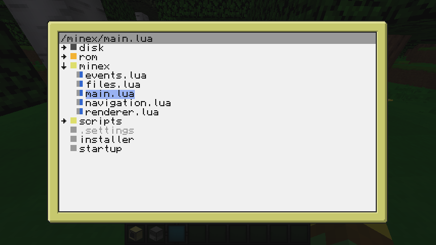

# MineExplorer

A file explorer for ComputerCraft and CC: Tweaked

Features
- Tree view display of files and folders
- Navigation with both mouse and keyboard
- Color coded icons depending on type
- Editing and executing files from within the explorer
- Renaming files

## Installation

Run `pastebin run tCYT5FBf`.

This will install the necessary files into the /minex folder and create an alias which you can use to launch the program: `minex`

